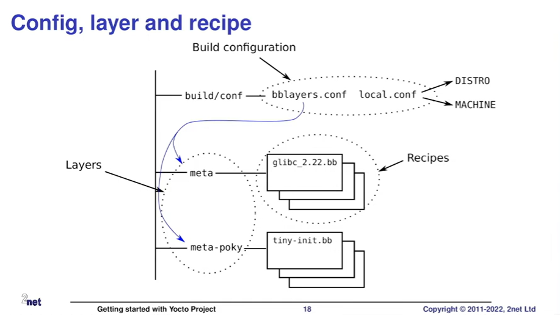

Contents of this readme are majorly taken from the NDC Conf [talk](https://youtu.be/8M8U1EgnUVw?feature=shared).

- What it Yocto Project?
  It's a tool which helps us building a Linux distro. It's majorly useful for embedded devices which doesn't have an Ubuntu distro available.
- Notable files in the image below:
  
  - `build` folder is the filename used by default, if we don't specify the filename while sourcing the environment variables in the shell.\\
    Command to load the environment variables is: `source ./oe-init-build-env <builddir>`.
  - `build` directory is inside `poky` folder.
  - The conf file has `bblyaers.conf` & `local.conf` files. `bblayers.conf` file contains the list of meta layers and `local.conf` contains extra configurations about machine and distro etc that we want to base our build on.
  - The meta layers have files with `.bb` (bit-bake) extension. `glibc_xx` file creates the buildable artifacts. The `.bb` files are called recipes.

### Three Central Concepts (Independently configurable of one another):
1. Distro:
  1. How we want to put our system together
  2. It has some configuration which can set some policy decisions for the distro. For example, do we want to use the latest version of all the libraries or more stable versions?
  3. It is set in `conf/local.conf` file as: `DISTRO ?= "poky"`. It selects Poky distro defined in `meta-poky/conf/distro/poky.conf`. 
  4. Which init manager we want to use - systemd, system-v-init or some other daemon?
  5. Policy decisions apply to everything that we build in the distro.
  6. Usually we don't need to prod the distro.
2. Machine:
   1. The target machine for which we are building the distro, the hardware (R-Pi, Beagle bone etc.).
   2. In the same `conf/local.conf` file target machine is selected:  `MACHINE := "beaglebone-yocto"`.
   3. It actually refers to a file name `beaglebone-yocto.conf` in the meta layer's machine configuration file, for example `meta-yocto-bsp/conf/machine/beaglebone-yocto.conf` file.\\
      NOTE: The filename present in the meta folder follows the same convention as in the case of Distro setup.
3. Image:
   1. List of all the packages that we want to build. Installed packages that we want to be installed in our distro which will be available for use at runtime.
   2. Images are specified by the recipes, not by any configuration file.

 ### Bitbake:
 - It's the tool which does the heavylifting and builds the distro.
 - It reads the recipes to create a dependency tree and schedules them for execution in the least possible time to build.
   #### Images:
   - They are named like `core-image-<image-type>`. For example, `core-image-minimal` has the minimum thing we need to bootup and have a command shell.
   - Similarly, `core-image-base` is same with few additional functionalities like being able to load kernel modules. `core-image-x11` provides a small x11 server based graphical system, including xterminal app.
   - To build the image, we can use command `bitbake core-image-minimal`. It actually begins with building the cross-compiler. Cross-compiler is built from the source - typically gcc but can also be clang.
   
